# 藏经阁

Sutras

## 实际效果截图

### web效果

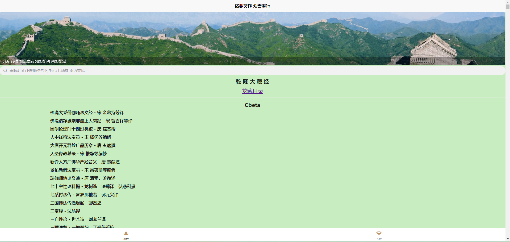

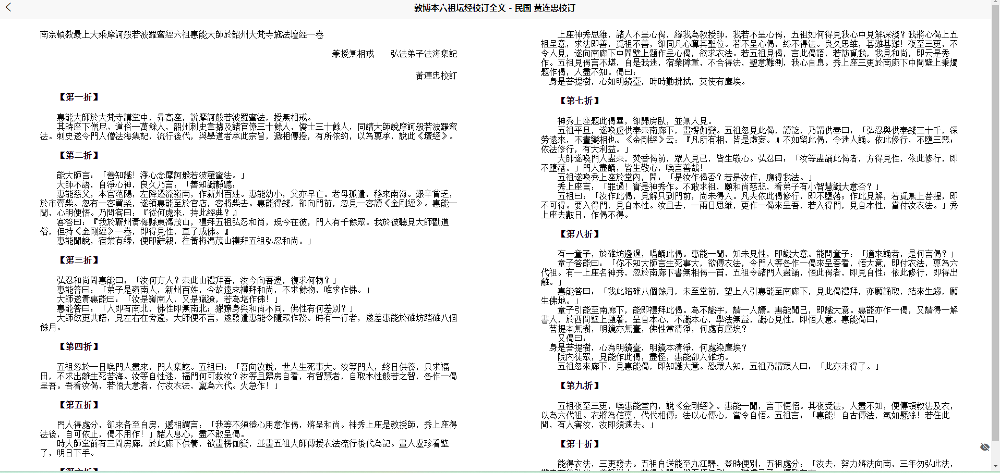

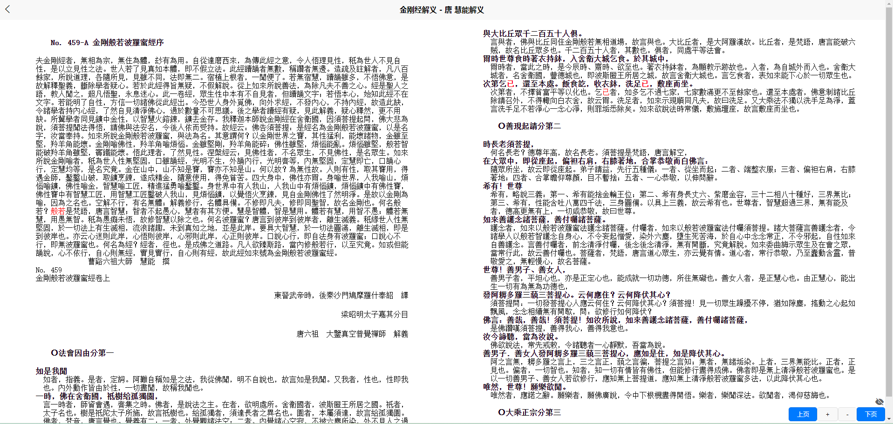

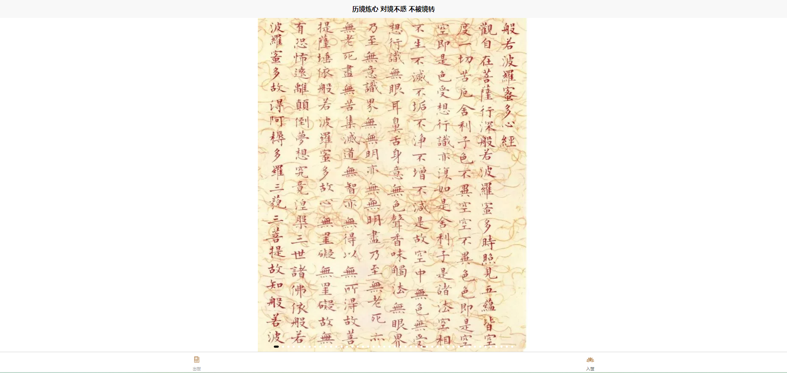

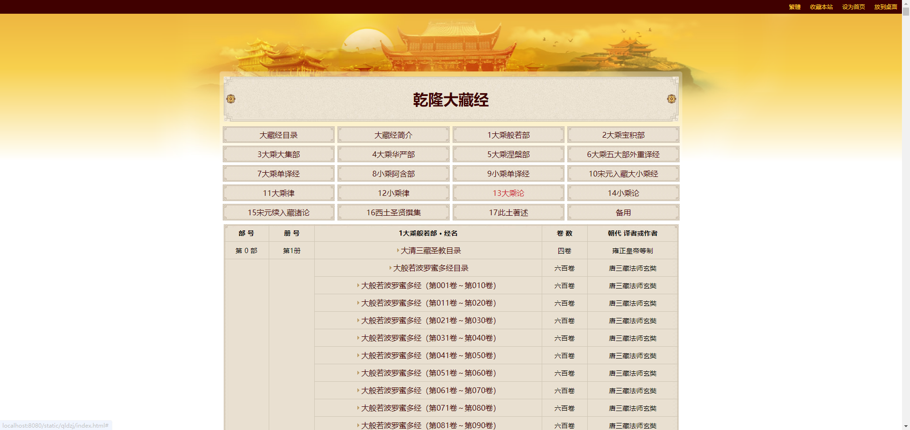

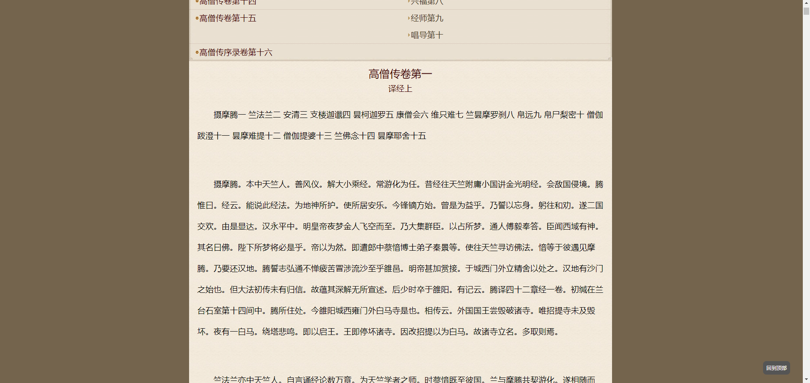

### h5/app效果

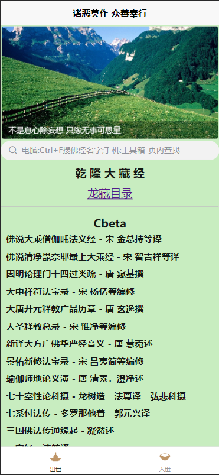

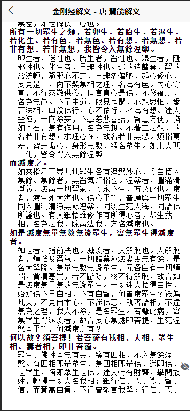

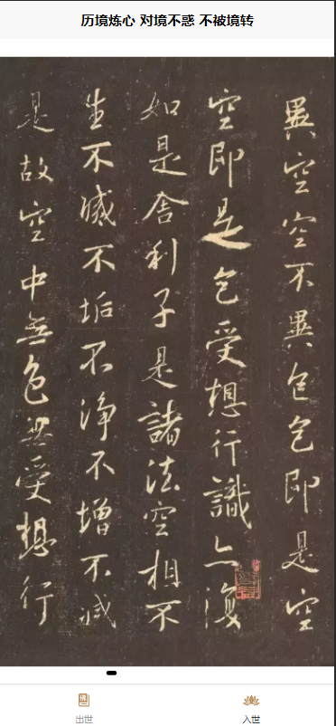

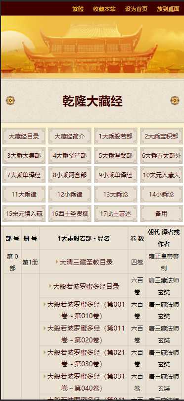

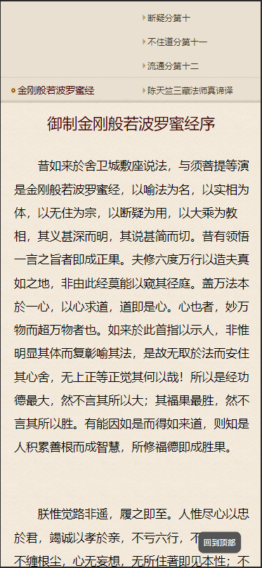

## 简单搭建教程

1.  下载或克隆源代码到自己电脑上 不会的百度
2.  先确定电脑是否有uniapp运行环境 没有看第3步 有则看4
3.  下载HBuilderX 官网 https://hx.dcloud.net.cn/Tutorial/install/windows
4.  打开HBuilderX 导入下载的源码
5.  遇到问题请善用搜索引擎 [uniapp官网API文档](  https://uniapp.dcloud.net.cn/api/ ) 或联系开发者联系方式如下

[开发者空间 ]( https://www.bilibili.com/video/BV1PDwJetE1D ) QQ:1711557991

此身不向今生度，更待何生度此身。 

西方急急早修持，生死无常不可期，

窗外日光弹指过，为人能有几多时？

人命无常呼吸间，眼观红日落西山；

宝山历尽空回首，一失人身万劫难。 

一句弥陀最方便，不费工夫不费钱；

但教一念无间断，何愁难到法王前。

